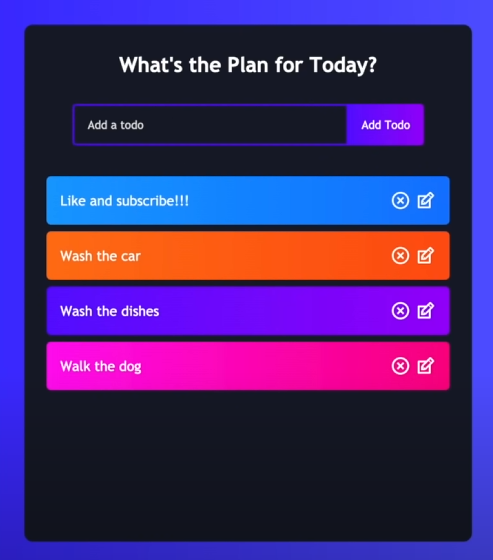
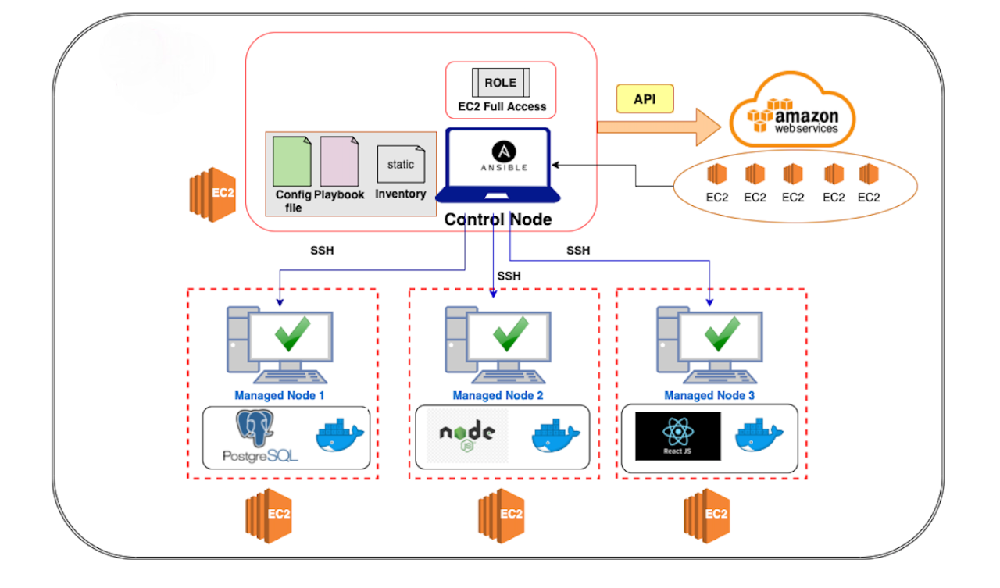

# Ansible Project  
Web Page Application (Postgresql-Nodejs-React) deployed on an AWS EC2 server with Ansible and Docker



## Description

The Forza Web-Page Application aims to deploy web-page written Nodejs and React Frameworks on AWS Cloud Infrastructure using Ansible. 

The infrastructure building process is orchestrated using Ansible as a control node. It comprises one control node and three EC2 instances as worker nodes, launched through the AWS console. 

The web page consists of three primary components: PostgreSQL, Node.js, and React. Each component operates within a dedicated Docker container on the respective EC2 instances. 

PostgreSQL serves as the web page's database, Node.js manages the backend, and React handles the frontend.


## Project Architecture



Registration data should be kept in separate PostgreSQL database located in one of EC2s. Nodejs framework controls backend and serves on port 5000, it is als connected to the PostgreSQL database on port 5432. React framework controls the frontend and it is also connected to the Nodejs server on port 5000. React server broadcasts web-page on port 3000. 

- The Web Application will be deployed using Nodejs and React framework.

- The Web Application should be accessible via web browser from anywhere on port 3000.

- EC2's and their security groups should be created on AWS console.

- Security groups should be attached to EC2's with at least permission rule.

- The rest of the process has to be controlled with control node which is connected SSH port.

- Codes written by Forza developers should be pulled from the Forza Repo into the control node and sent them to the EC2's from here with Ansible.

- Postgresql, Nodejs and React parts has to be placed in docker container. 

- Launch an EC2 for each postgresql, nodejs and react docker container. In addition, write three different playbook groups for this project. 
    - First one is to write playbook to control all process for each worker instance separately. 
    - Second one is to control all process in one playbook without using roles.
    - Third one is to control all process in one playbook using roles

In the architecture, you can configure your architecture with these conditions,

  - All process has to be controlled into the `control Node`

  - Dynamic inventory has to be used for inventory file.

  - Ansible config file has to be placed in control node.
  
  - Docker should be installed in all worker nodes using ansible.

  - `todo-app-pern` file should be pulled from Github Repo at the beginning.

  - For PostgreSQL worker node

    - PostgreSQL files (Dockerfile and init.sql) should be sent into it from control node using ansible

    - Docker image should be created for PostgreSQL container and init.sql file should be placed under necessary folder.

    - Create PostgreSQL container. Do not forget to set password as environmental variable. This password has to be protected with ansible vault.

    - Please make sure this instance's security group should be accept traffic from PostgreSQL's dedicated port from Nodejs EC2 and port 22 from anywhere.

    - To keep database's data, volume has to be created with docker container and necessary file(s) should be kept under this file.

  - For Nodejs worker node

    - Please make sure to correct or create `.env` file under `server` folder based on PostgreSQL environmental variables
    
    - Nodejs's `server` folder should be sent into it from control node using ansible. This file will use for docker image. You don't need any extra file for creating Nodejs image.

    - Docker image should be built for Nodejs container

    - Create Nodejs container and publish it on port 5000

    - Please make sure this instance's security group should be accept traffic from 5000, 22 dedicated port from anywhere.

  - For React worker node

    - Please make sure to correct `.env` file under `client` folder based on Nodejs environmental variables 
    
    - React's `client` folder should be sent into it from control node using ansible. This file will be used for docker image. You don't need any extra file for creating react image.

    - Docker image should be created for React container

    - Create React container and publish it on port 3000

    - Please make sure this instance's security group should be accept traffic from 3000, and 80 dedicated port from anywhere.


## Project Skeleton 

```text
forza_ansible_proj (folder)
|
|----Readme.md               # Given to the students (Definition of the project)
|----todo-app-perm (folder)  # Given to the students (Nodejs and React files)
|       1.server (folder) ---> Nodejs folders and files
|       2.client (folder) ---> React folders and files
|       3.database (folder)--> init.sql file 
|----developer_notes.txt     # Given to the students (txt file)
|----Ansible-Playbook        # This will be created by student
```

## Expected Outcome


### Topics Covered in this Project:

- Ansible playbook preparation without roles

- Ansible playbook preparation with roles.

- Bash scripting

- AWS Security groups create and attach to EC2.

- Launch EC2 and it's configurations

- Write dockerfile for postgresql, nodejs and react images.

- Docker image creation for postgresql, nodejs and react containers with ansible playbook

- Docker container launching using created image with ansible playbook

- Git & Github for Version Control System

### This is an excellent project to learn end-to-end Ansible configuration and web deployment. If you complete this project, you will learn how to: 

- Write Ansible playbook in different ways which are without Roles and with Roles

- Apply web programming skills, importing packages within Nodejs and React Frameworks

- Write Dockerfiles for different environments

- Create containers which use React, Nodejs and PostgreSQL docker images 

- Configure connection to the `PostgreSQL` database.

- Connect backend server to database

- Configure Nodejs Framework

- Connect frontend server to backend server

- Configure React Framework for development environment

- Configure React Framework for production environment

- Demonstrate bash scripting skills using `Ansible playbook` to setup web-page on EC2 Instance.

- Apply git commands (push, pull, commit, add etc.) and Github as Version Control System.

## Resources

- [Ansible Documentation Framework](https://docs.ansible.com/ansible/2.5/user_guide/index.html)

- Image credits for To Do App Frontend (Brian Codex - https://github.com/briancodex/react-todo-app-v1/tree/master/src)

- [AWS CLI Command Reference](https://docs.aws.amazon.com/cli/latest/index.html)
